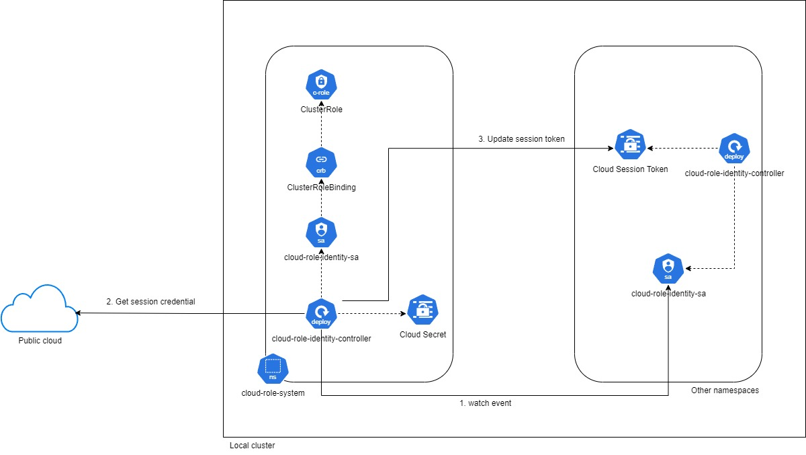

# k8s-pod-identity-controller

This is a project to solve the problem of role association with cloud role, service-account,... Right now, GCP support the feature quite well but for cases
like AWS, it's not well designed so you either have to use: OIDC/ISRA/Pod Role Association. All of them are clunky and not easy to use/maintain. Especially
for cases where you run your cluster on premise and needed permission access to cloud.

This project solve all of that problem so you don't have to deal with the hassle of setting up those infrastructure. This aim to create role association 
controller where it will fetch the session credentials/token and inject into the workload pod without the need of you do it yourself. This also gonna support
multi cloud.

So use this when:
- You want an easy way to associate your role to cloud
- You having a local/on prem cluster that need access cloud infra
- You have multicloud infrastructure

!NOTE:
    This is good for dev environment, but for production environment, please you this with awareness.

# Architecture

